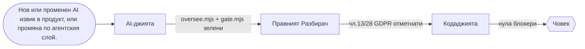
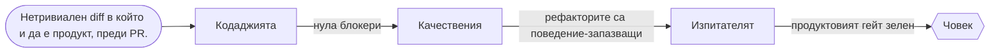
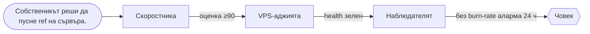
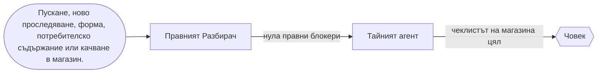

# Екипите на флота

> Генерирано от `_teams.json` с `node tools/agents/teams.mjs --write` — не редактирай на ръка;
> `node tools/agents/teams.mjs --check` (в `gate.mjs`) пада, ако се разминат.

## ЗАПОЧНИ ОТТУК

1. `node tools/agents/teams.mjs --route "<задачата с твои думи>"` → екип, първи агент и потокът му.
2. Пусни този агент с шаблона за задача по-долу. Картата му (вход, изход, на кого предава, къде е човекът) му се подава при старт.
3. Не хваща нищо или е равно между два екипа → **AI-джията** решава. Не гадай.
4. Една задача — един екип. Друг екип се включва само на гейт (неговата стъпка в потока), не „за всеки случай“.

## Екипите

| Екип | Водач | Членове | Мисия |
|---|---|---|---|
| **Щабът** `shtab` | AI-джията | AI-джията | Кой кога работи: избор на поток и агент, надзор на флота, LLM интеграции в продуктите. |
| **Ковачницата** `kod` | Кодаджията | Кодаджията, Качествения, Изпитателят, Разбивача, Конвейерът | Кодът да е верен, сигурен, поддържаем и пазен от тестове и CI. |
| **Пускането** `pusk` | VPS-аджията | VPS-аджията, Скоростника, Наблюдателят | Продуктът да стигне до сървъра бързо, безопасно и да остане здрав след това. |
| **Думите** `dumi` | Летописецът | Летописецът, Преводач, Сийдъра | Текстът — документация, съдържание и преводи — е верен, с източник и на трите езика. |
| **Растежът** `rastezh` | SEO | SEO, Социалджията, Анализаторът | Да ни намират (търсачки и AI отговори), да ни виждат (социални мрежи) и да знаем какво работи (метрики). |
| **Парите** `pari` | Продавача | Продавача, Касаджията, Трейдъра, Голаджията | Всеки код, който пипа пари — плащане, каса, поръчка, залог — е точен, идемпотентен и с човешка спирачка. |
| **Нормите** `pravo` | Правният Разбирач | Правният Разбирач, Тайният агент, Асансьорчика | Правото на ЕС, политиките на платформите и техническите норми — с точка, издание и източник. |
| **Платформите** `platformi` | Мобилджията | Мобилджията, Хромаджията, Дискорджията, Геймъра | Продуктите там, където живеят чужди платформи: телефон, браузър, Discord, FiveM. |
| **Формата** `forma` | Дизайнера | Дизайнера, 3D Maniac, Принтаджията | Как изглежда и как става физически: уеб ефекти, 3D от скан, печат. |

## Щабът

Кой кога работи: избор на поток и агент, надзор на флота, LLM интеграции в продуктите.

**Основен поток — AI/LLM интеграция.** Тръгва при: Нов или променен AI извик в продукт, или промяна по агентския слой.



| Стъпка | Агент | Прави | Гейт към следващата |
|---|---|---|---|
| 1 | AI-джията | сверява живите докове, ключ само на сървъра, бюджетен таван, идемпотентност | oversee.mjs + gate.mjs зелени |
| 2 | Правният Разбирач | разкрива трансфера на данни към доставчика | чл.13/28 GDPR отметнати |
| 3 | Кодаджията | ревю на кода около извика | нула блокери |

**Човешка точка:** Собственикът избира доставчика и модела; лични данни към доставчик — само с негово решение.

**Тестови задачи (рутингът трябва да ги прати точно тук):**

- „смени модела на агента в piuma с по-нов Claude“ → AI-джията
- „кой агент да пусна за тази задача и в какъв ред“ → AI-джията
- „отговорът от Gemini се реже по средата, оправи извика“ → AI-джията
- „добави нов агент към флота и го вкарай в гейта“ → AI-джията
- „намали разхода на токени при агентите“ → AI-джията

**Вероятни провали:**

1. Делегира заради самото делегиране — задача за един ред минава през три агента и плаща три префикса.
2. Модел по спомен — ID-то е отпаднало и извикът връща 404 в продукция.
3. Пусната верига без дневник — блокерът потъва и никой не довършва.

**Какво мерим след пускане:**

- незавършени/блокирани вериги — `node tools/agents/flow-ledger.mjs --report`
- реален разход по агенти — `node tools/agents/usage-report.mjs`

## Ковачницата

Кодът да е верен, сигурен, поддържаем и пазен от тестове и CI.

**Основен поток — Промяна по код.** Тръгва при: Нетривиален diff в който и да е продукт, преди PR.



| Стъпка | Агент | Прави | Гейт към следващата |
|---|---|---|---|
| 1 | Кодаджията | бъгове и уязвимости с файл:ред, самопроверени | нула блокери |
| 2 | Качествения | поддръжаемост — само ако промяната е нетривиална | рефакторите са поведение-запазващи |
| 3 | Изпитателят | тест, който пада без поправката и минава с нея | продуктовият гейт зелен |

**Човешка точка:** Сливането в main е решение на човек; CI не пуска в продукция.

**Тестови задачи (рутингът трябва да ги прати точно тук):**

- „прегледай diff-а за бъгове и SQL injection“ → Кодаджията
- „тази функция е трудна за поддръжка, има дублиране на три места“ → Качествения
- „e2e тестът с playwright е flaky, стабилизирай го“ → Изпитателят
- „workflow-ът в github actions е червен заради кеша“ → Конвейерът
- „атакувай новия вход на linketto като red-team преди пускане“ → Разбивача

**Вероятни провали:**

1. Шум: двайсет козметични находки скриват единствения реален блокер.
2. Рефактор върху непотвърден бъг — поведението се сменя „тихо“.
3. Тест, който минава и без поправката — пази нищо.

**Какво мерим след пускане:**

- дефекти по агенти (находки, оборени после) — `node tools/agents/defect-rate.mjs`
- сигнали за качество по агент — `node tools/agents/critique.mjs --agent kodadjiyata`

## Пускането

Продуктът да стигне до сървъра бързо, безопасно и да остане здрав след това.

**Основен поток — Пускане в продукция.** Тръгва при: Собственикът реши да пусне ref на сървъра.



| Стъпка | Агент | Прави | Гейт към следващата |
|---|---|---|---|
| 1 | Скоростника | лабораторен одит срещу локален билд | оценка ≥90 |
| 2 | VPS-аджията | fetch-deploy.sh → autodeploy.sh, health-check, rollback | health зелен |
| 3 | Наблюдателят | SLO и аларми след пускането | без burn-rate аларма 24 ч |

**Човешка точка:** Собственикът решава кога и кой ref; миграция с изтриване — само с изрично да.

**Тестови задачи (рутингът трябва да ги прати точно тук):**

- „деплойни piuma на сървъра с autodeploy“ → VPS-аджията
- „страницата е бавна, lcp е 4 секунди“ → Скоростника
- „настрой slo и аларми за medqr след пускането“ → Наблюдателят
- „сертификатът tls на nginx изтича, поднови го“ → VPS-аджията
- „инцидент: 500-ки в логовете от снощи“ → Наблюдателят

**Вероятни провали:**

1. Пускане без бекъп преди миграция — няма връщане.
2. Лабораторната оценка се представя като полеви данни.
3. Аларма по причина вместо по симптом — будят те за нищо, а истинското спиране минава.

**Какво мерим след пускане:**

- autodeploy е изряден — `node tools/vps/deploy-check.mjs deploy/autodeploy.sh`
- незавършени вериги по пускане — `node tools/agents/flow-ledger.mjs --report`

## Думите

Текстът — документация, съдържание и преводи — е верен, с източник и на трите езика.

**Основен поток — Ново съдържание или документация.** Тръгва при: Потребителски-видима промяна или ново съдържание.


| Стъпка | Агент | Прави | Гейт към следващата |
|---|---|---|---|
| 1 | Сийдъра | сийд с проверени факти (за zabobovdol) | check-dups/integrity |
| 2 | Летописецът | README/CHANGELOG/runbook; всяка команда пусната | примерите минават |
| 3 | Преводач | BG → EN → IT с паритет на ключовете | parity зелен |

**Човешка точка:** Медицински и правни низове не се превеждат машинно — човек ги одобрява.

**Тестови задачи (рутингът трябва да ги прати точно тук):**

- „обнови changelog-а за новата версия“ → Летописецът
- „преведи новите низове на италиански“ → Преводач
- „добави ново ръководство „Как да…“ като seed в zabobovdol“ → Сийдъра
- „напиши readme за онбординг на нов разработчик“ → Летописецът
- „провери локализацията на medqr на английски“ → Преводач

**Вероятни провали:**

1. Факт без източник влиза в seed-а и отива на живо.
2. Команда в документацията, която никой не е пускал.
3. Сляп машинен превод на клиничен термин.

**Какво мерим след пускане:**

- твърдения сверени в срок — `node tools/agents/claims-audit.mjs --check`
- дефекти по агенти — `node tools/agents/defect-rate.mjs`

## Растежът

Да ни намират (търсачки и AI отговори), да ни виждат (социални мрежи) и да знаем какво работи (метрики).

**Основен поток — Откриваемост и обхват.** Тръгва при: Нова или променена страница, кампания или въпрос „работи ли“.


| Стъпка | Агент | Прави | Гейт към следващата |
|---|---|---|---|
| 1 | SEO | мета, JSON-LD, hreflang, sitemap; ≥5 ключови думи с „Carbon Stealth“ | IndexNow пуснат след деплой |
| 2 | Анализаторът | какво мерим и как — без PII, със съгласие | tracking plan одобрен |
| 3 | Социалджията | hook, сценарий, план за публикуване | чернова |

**Човешка точка:** Публикуването в социалните мрежи го одобрява човек; проследяване — само след съгласие.

**Тестови задачи (рутингът трябва да ги прати точно тук):**

- „направи seo одит на сайта и оправи hreflang“ → SEO
- „сценарий за reels с по-голям обхват“ → Социалджията
- „направи фуния и retention анализ за linketto“ → Анализаторът
- „подай новия sitemap през indexnow“ → SEO
- „план за пост в instagram за пускането“ → Социалджията

**Вероятни провали:**

1. Промяна по страници без IndexNow — Bing вижда старото седмици.
2. Проследяване преди съгласие — нарушение на ePrivacy.
3. Корелация, представена като причина, без A/B.

**Какво мерим след пускане:**

- сигнали за качество на SEO — `node tools/agents/critique.mjs --agent seo`
- дефекти по агенти — `node tools/agents/defect-rate.mjs`

## Парите

Всеки код, който пипа пари — плащане, каса, поръчка, залог — е точен, идемпотентен и с човешка спирачка.

**Основен поток — Паричен код.** Тръгва при: Промяна, която докосва сума, плащане, бон, поръчка или залог.


| Стъпка | Агент | Прави | Гейт към следващата |
|---|---|---|---|
| 1 | Продавача | сумата от сървъра, права само през проверен webhook, идемпотентност | stripe-lint зелен |
| 2 | Кодаджията | сигурностно ревю на паричния код (цели центове, без float) | нула блокери |
| 3 | Правният Разбирач | отказ 14 дни, ДДС/OSS, Omnibus | „не е правен съвет“ |

**Човешка точка:** Реални пари, реални поръчки и реални залози пуска само човекът.

**Тестови задачи (рутингът трябва да ги прати точно тук):**

- „добави stripe checkout с абонамент и webhook“ → Продавача
- „касовият бон в CSPos не излиза на фискалното устройство“ → Касаджията
- „направи честен бектест на стратегията в treydar“ → Трейдъра
- „анализ на мача с xg и коефициенти“ → Голаджията
- „ддс и фактура при плащане от италия“ → Продавача

**Вероятни провали:**

1. Сумата идва от клиента и се приема на доверие.
2. Продажба се записва, макар фискалният бон да не е минал.
3. Бектест с look-ahead и без такси — „печалба“, която я няма.

**Какво мерим след пускане:**

- инвариантите на домейн-собствениците са в материала — `node tools/agents/invariant-check.mjs --check`
- сигнали за качество на Касаджията — `node tools/agents/critique.mjs --agent kasadjiyata`

## Нормите

Правото на ЕС, политиките на платформите и техническите норми — с точка, издание и източник.

**Основен поток — Съответствие преди пускане.** Тръгва при: Пускане, ново проследяване, форма, потребителско съдържание или качване в магазин.



| Стъпка | Агент | Прави | Гейт към следващата |
|---|---|---|---|
| 1 | Правният Разбирач | GDPR/ePrivacy/DSA/EAA одит с файл:ред | нула правни блокери |
| 2 | Тайният агент | политиките на Apple/Google/Meta, етикети за поверителност | чеклистът на магазина цял |

**Човешка точка:** Изводът не е правен съвет; съответствието решава човек (юрист, инженер).

**Тестови задачи (рутингът трябва да ги прати точно тук):**

- „провери банера за бисквитки и gdpr преди пускане“ → Правният Разбирач
- „apple отказа приложението при app review, разчети причината“ → Тайният агент
- „коя точка от en 81-20 важи за височината на кабината“ → Асансьорчика
- „попълни data safety формуляра за google play“ → Тайният агент
- „одит на достъпността по eaa и wcag“ → Правният Разбирач

**Вероятни провали:**

1. Правен извод без „не е правен съвет“.
2. Заобикаляне на ревю вместо поправка на причината — перманентен бан.
3. Стойност от норма без издание и точка.

**Какво мерим след пускане:**

- правни и таксономични твърдения сверени в срок — `node tools/agents/claims-audit.mjs --check`
- сигнали за качество на Правния — `node tools/agents/critique.mjs --agent pravniyat-razbirach`

## Платформите

Продуктите там, където живеят чужди платформи: телефон, браузър, Discord, FiveM.

**Основен поток — Билд за платформа.** Тръгва при: Нов билд или функция за мобилно, Chrome, Discord или FiveM.


| Стъпка | Агент | Прави | Гейт към следващата |
|---|---|---|---|
| 1 | Мобилджията | билд и нативни функции (или Хромаджията/Дискорджията/Геймъра по платформа) | store-readiness зелен |
| 2 | Тайният агент | политиките на магазина | чеклистът цял |
| 3 | Кодаджията | ревю на backend-а | нула блокери |

**Човешка точка:** Качването в магазин и отговорите на ревю ги прави човекът.

**Тестови задачи (рутингът трябва да ги прати точно тук):**

- „направи android twa за zabobovdol“ → Мобилджията
- „мигрирай разширението за chrome към manifest v3“ → Хромаджията
- „добави slash команда в discord бота“ → Дискорджията
- „напиши fivem ресурс на lua с qbcore“ → Геймъра
- „push известия за ios с nfc четене“ → Мобилджията

**Вероятни провали:**

1. Тайна в бъндъла на приложението или разширението.
2. Широки permissions „за всеки случай“ — отказ в магазина.
3. Валидация на клиента във FiveM — читърите я прескачат.

**Какво мерим след пускане:**

- най-малки права на агентите — `node tools/agents/tools-audit.mjs`
- дефекти по агенти — `node tools/agents/defect-rate.mjs`

## Формата

Как изглежда и как става физически: уеб ефекти, 3D от скан, печат.

**Основен поток — Визуален ефект или физическа част.** Тръгва при: Нов визуален ефект, или част от скан до печат.


| Стъпка | Агент | Прави | Гейт към следващата |
|---|---|---|---|
| 1 | Дизайнера | ефект с reduced-motion резерв (или 3D Maniac за скан→CAD) | motion-a11y зелен |
| 2 | Принтаджията | DfAM и слайс за K2 Plus | printability зелен |

**Човешка точка:** Режимът (сериозен или творчески) се задава от човека; физическата част се проверява преди употреба.

**Тестови задачи (рутингът трябва да ги прати точно тук):**

- „направи webgl hero ефект с шейдър“ → Дизайнера
- „от скана направи cad модел с nurbs за карбоновия калъп“ → 3D Maniac
- „слайсни модела за печат на k2 с две нишки“ → Принтаджията
- „gsap анимация при скрол на витрината“ → Дизайнера
- „поправи stl-а, не е watertight за fdm печат“ → Принтаджията

**Вероятни провали:**

1. Декоративна анимация в спешния изглед на medqr.
2. Ефект без prefers-reduced-motion резерв или с над 3 проблясъка в секунда.
3. Модел от скан директно към печат, без deviation анализ.

**Какво мерим след пускане:**

- сигнали за качество на Дизайнера — `node tools/agents/critique.mjs --agent dizayner`
- дефекти по агенти — `node tools/agents/defect-rate.mjs`

## Картите на агентите

Всеки агент получава своята карта при старт (`memory-preload.mjs`).

| Агент | Екип | Тръгва при | Получава | Връща | Предава на | Човек одобрява |
|---|---|---|---|---|---|---|
| AI-джията | Щабът | задача без ясен собственик, AI извик в продукт, промяна по флота | задачата от човека | кой поток и кои агенти, с цел, формат и граници; или поправен LLM извик | водача на избрания екип | избор на доставчик/модел и всичко, което пипа лични данни |
| Кодаджията | Ковачницата | нетривиален diff преди PR | diff и обхват | находки по тежест с файл:ред и минимална поправка | Качествения (поддръжаемост) или Изпитателя (тест за поправката) | сливането в main |
| Качествения | Ковачницата | нетривиална кодова промяна или „труден за поддръжка“ код | diff или модул | рефактори по въздействие × усилие, поведение-запазващи | Изпитателя (мрежата преди рефактора) | архитектурна промяна извън текущия diff |
| Изпитателят | Ковачницата | поправка без тест, нов поток, flaky тест | поправката и критичния поток | тестове, които падат без поправката | Кодаджията, ако тестът разкрие бъг | изключване на тест |
| Разбивача | Ковачницата | преди пускане или нова повърхност за атака | системата и модела на заплахата | опити за пробив с доказателство и поправка | собственика на домейна (Кодаджията, Продавача, VPS-аджията) | реална дупка → координирано разкриване |
| Конвейерът | Ковачницата | червен или бавен CI, нов workflow | workflow-а и лога | зелен, path-филтриран, пиннат workflow | VPS-аджията за стъпка извън GitHub | required checks и права на токена |
| VPS-аджията | Пускането | деплой, сървър, TLS, бекъп | ref и списък продукти | пуснат release с health-check и път за връщане | Наблюдателя (след пускането) | кога и кой ref; разрушителна миграция |
| Скоростника | Пускането | преди деплой, бавна страница, регресия на CWV | локален билд или URL | оценка 0–100 и какво пречи на 100 | Дизайнера или Кодаджията по причината | приемане на бюджет под 90 |
| Наблюдателят | Пускането | след пускане, инцидент, нужда от SLO | услугата и нейните логове/метрики | SLO, аларми по симптом, диагноза | Кодаджията (бъг), VPS-аджията (инфра), Летописеца (postmortem) | error budget политика |
| Летописецът | Думите | потребителски-видима промяна, нужда от документ | промяната | README/CHANGELOG/ADR/runbook с пуснати примери | Преводача | правни документи → Правния |
| Преводач | Думите | нов или променен UI текст | BG източника | EN и IT с паритет на ключовете | SEO (hreflang) | медицински и правни низове |
| Сийдъра | Думите | ново съдържание за zabobovdol | фактите с източник | идемпотентен seed, регистриран в db:seed:all | Преводача | факт без източник — спира |
| SEO | Растежът | нова/променена страница, sitemap, JSON-LD | страниците | находки по ефект × усилие, ключови думи, IndexNow | Скоростника (CWV), Преводача (hreflang) | деплоят, след който тръгва IndexNow |
| Социалджията | Растежът | пускане, кампания, клип | продукта и аудиторията | hooks, сценарии, план за публикуване | Анализатора (мерене на обхвата) | публикуването |
| Анализаторът | Растежът | „работи ли“, нова метрика, A/B тест | въпроса и данните | tracking plan, фунии, прочетен експеримент | Правния (съгласие), Продавача (приходи) | проследяване — само със съгласие |
| Продавача | Парите | checkout, абонамент, webhook, фактура | паричния поток | идемпотентен код с проверен webhook | Кодаджията (ревю), Правния (14 дни, ДДС) | реални пари |
| Касаджията | Парите | касов или фискален код в CSPos | касовия поток | код по Н-18/СУПТО, цели евроценти | Кодаджията, после Изпитателя | нормативната изрядност; „не е правен съвет“ |
| Трейдъра | Парите | трейдинг бот или бектест | стратегията и пазара | риск-първо код и честен бектест | Кодаджията, VPS-аджията (ключове) | реални поръчки |
| Голаджията | Парите | анализ на мач, value залог | мача и пазара | вероятности, стойност след маржа, дробен Kelly | Кодаджията (математиката) | реален залог |
| Правният Разбирач | Нормите | пускане, проследяване, форма, потребителско съдържание | сайта или промяната | одит с файл:ред; „не е правен съвет“ | собственика на кода (поправката е негова) | правното решение |
| Тайният агент | Нормите | качване в Apple/Google/Meta/Web Store, отказ при ревю | билда и декларациите | изрядност по политиките, разчетен отказ | Мобилджията/Хромаджията (поправка), Правния | отговорът на ревюто |
| Асансьорчика | Нормите | въпрос по норма за асансьори | въпроса и изданието | документ + издание + точка + стойност | Кодаджията (код), Изпитателя (тест на стойността) | инженерът решава съответствието |
| Мобилджията | Платформите | мобилен билд или нативна функция | продукта | билд, готов за магазина | Тайния агент (ревю) | качването |
| Хромаджията | Платформите | разширение за Chrome/Edge | разширението | MV3 с минимални permissions | Тайния агент (Web Store) | качването |
| Дискорджията | Платформите | Discord бот или интеграция | бота | interactions с defer под 3 s, проверка Ed25519 | Кодаджията/VPS-аджията | токенът и intents |
| Геймъра | Платформите | FiveM ресурс | ресурса | Lua със сървърна валидация | Кодаджията при общ код | пускането на сървъра |
| Дизайнера | Формата | визуален ефект, hero, анимация | режима (сериозен/творчески) и страницата | ефект с reduced-motion резерв | Скоростника (CWV) | режимът |
| 3D Maniac | Формата | скан към CAD, карбонова форма | мрежата от скана | solid/NURBS с deviation отчет | Принтаджията | проверка на физическата част |
| Принтаджията | Формата | модел за печат на K2 Plus | модела | печатаем модел и 3MF слайс | човека (печатът е физически) | проверка на отпечатъка |

## Шаблон за задача

Подава се на агента при делегиране — само това, без цялата история:

```
ЦЕЛ: <едно изречение — какво трябва да е вярно накрая>
ВХОД: <файлове/diff/URL/данни — точно, с пътища>
ГРАНИЦИ: <какво НЕ пипаш; продукт; само четене или и запис>
ГОТОВО Е, КОГАТО: <гейт — команда, която минава, или проверим критерий>
ИЗХОД: блок ПРЕДАВАНЕ (_memory/PROCEDURE.md)
```

## Чести грешки

- Три агента за задача на един агент — всеки плаща цял префикс; потокът е до 3 стъпки.
- Агент извън картата си „помага“ в чужд домейн, вместо да предаде с блокер.
- Задача без „готово е, когато“ — агентът спира, когато му омръзне, не когато е готово.
- Пропусната човешка точка при пари, право, медицина или пускане.
- Нов агент вместо нова поука — пролука в екип се доказва с вериги в `flow-ledger.mjs`, не с усещане.

## Какво НЕ строим още

- Агент, който вика агент: решението кой е следващият остава на оркестратора (виж `_orchestration.md`).
- Нови екипи или агенти, докато екипът няма записана верига в `flow-ledger.mjs`, която е спряла заради липсата.
- Автоматичен рутинг без човек при равенство: равенството отива при водача на флота.
