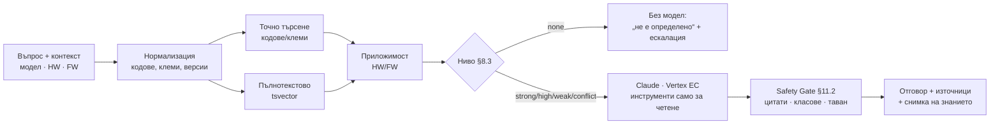

# ChatChat

AI техническа поддръжка за табла за управление на асансьори. Техникът описва проблема (код за
грешка, фаза, симптоми); системата търси във версионираната база знания на производителя, Claude
предлага диагноза **само от намерените източници**, а детерминистичният Safety Gate маха всичко
непотвърдено или опасно, преди техникът да го види. Когато доказателствата не стигат, отговорът е
„не е определено“ + какво липсва + тикет за ескалация.

Изпълнява спецификацията „AI Technical Support Platform v1.1“ (09.10.2026), фаза **F1 — MVP**:
вход, продуктов контекст, RAG с цитати, база с кодове за грешка, Safety Gate, чат на случая, тикет.

## Как работи един отговор



## Локално

```bash
cd chatchat
npm ci
cp .env.example .env            # попълни PUBLIC_BASE_URL, DATABASE_URL, SESSION_PEPPER (≥32 знака)
npx prisma migrate deploy
npm run build
TENANT_SLUG=demo TENANT_NAME="Demo" USER_EMAIL=ko@example.test USER_NAME="Knowledge owner" \
  USER_PASSWORD='…поне 12 знака…' USER_ROLE=KNOWLEDGE_OWNER npm run tenant:create
npm run dev                     # http://localhost:4330
```

`VERTEX_PROJECT_ID` (+ ADC или `GOOGLE_APPLICATION_CREDENTIALS`) включва AI; без него случаите,
каталогът и знанието работят, а `POST /api/v1/chat/messages` връща 503 `ai_unavailable`.

## Знание: от документ до отговор

1. `POST /api/v1/admin/products` — модел, семейство, HW ревизии с обхват на FW.
2. `POST /api/v1/admin/documents` — метаданните от §7.2 + текст по страници → `DRAFT`.
3. `POST /api/v1/admin/documents/:id/submit` → `REVIEW` → `…/publish` → `PUBLISHED` (документ по
   безопасност — публикува друг човек; новата ревизия отписва предишната). `…/deprecate` го сваля.
4. `POST /api/v1/admin/errors` (сочи публикуван документ-източник) → `…/publish`.

AI вижда само `PUBLISHED`. Публикуване и отписване не искат преобучение (AC-10).

## API (v1)

| Метод      | Път                                                                                                                        | Роля                         |
| ---------- | -------------------------------------------------------------------------------------------------------------------------- | ---------------------------- |
| POST       | `/api/v1/auth/login` · `/logout` · GET `/me`                                                                               | всички                       |
| GET        | `/api/v1/products/search` · `/devices/:serial` · `/errors/:code` · `/documents/:id/pages/:page`                            | вписан (по аудитория/фирма)  |
| POST       | `/api/v1/sessions` (нов случай) · GET `/cases` · `/cases/:id` · `/cases/:id/timeline`                                      | техник+                      |
| PATCH/POST | `/api/v1/cases/:id/context` · `/cases/:id/outcome` · `/cases/:id/assign` (поддръжка)                                       | техник+                      |
| POST       | `/api/v1/chat/messages` · `/tickets` · `/feedback`                                                                         | техник+                      |
| POST       | `/api/v1/admin/products` · `/devices` · `/documents` (+ submit/reject/publish/deprecate) · `/errors` (+ publish/deprecate) | KNOWLEDGE_OWNER              |
| GET        | `/api/v1/audit`                                                                                                            | TENANT_ADMIN, PLATFORM_ADMIN |
| GET        | `/healthz` (жив) · `/readyz` (базата + дали AI е включен)                                                                  | —                            |

Всяка не-GET заявка иска хедър `x-csrf-token` (от `login`/`me`).

Деплой → [DEPLOY.md](DEPLOY.md) · сигурност → [SECURITY.md](SECURITY.md) · за агентите → [CLAUDE.md](CLAUDE.md).
