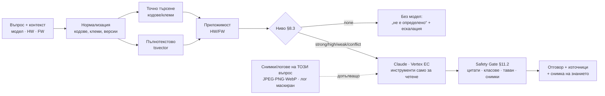

# ChatChat

AI техническа поддръжка за табла за управление на асансьори. Техникът описва проблема (код за
грешка, фаза, симптоми); системата търси във версионираната база знания на производителя, Claude
предлага диагноза **само от намерените източници**, а детерминистичният Safety Gate маха всичко
непотвърдено или опасно, преди техникът да го види. Когато доказателствата не стигат, отговорът е
„не е определено“ + какво липсва + тикет за ескалация.

Изпълнява спецификацията „AI Technical Support Platform v1.1“ (09.10.2026), фаза **F1 — MVP**:
вход, продуктов контекст, RAG с цитати, база с кодове за грешка, Safety Gate, чат на случая, тикет.

## Как работи един отговор



## Локално

```bash
cd chatchat
npm ci
cp .env.example .env            # попълни PUBLIC_BASE_URL, DATABASE_URL, SESSION_PEPPER (≥32 знака), MFA_ENC_KEY
npx prisma migrate deploy
npm run build
TENANT_SLUG=demo TENANT_NAME="Demo" USER_EMAIL=ko@example.test USER_NAME="Knowledge owner" \
  USER_ROLE=KNOWLEDGE_OWNER npm run tenant:create   # печата еднократен линк /reset#… за паролата
npm run dev                     # http://localhost:4330
```

`VERTEX_PROJECT_ID` (+ ADC или `GOOGLE_APPLICATION_CREDENTIALS`) включва AI; без него случаите,
каталогът и знанието работят, а `POST /api/v1/chat/messages` връща 503 `ai_unavailable`.
Прикачените файлове искат `ATTACHMENTS_DIR` + `ATTACHMENT_URL_KEY` + `FILES_KEK` (шифроване в
покой, `openssl rand -base64 32`; локално може и `FILES_ENCRYPTION=off` — в продукция не); качването
— и clamd (`CLAMAV_HOST`), иначе 503 `av_unavailable` (без проверка файл не се приема).
Поддръжката на шифрованите файлове: `npm run files:status|files:encrypt|files:rekey|files:verify`
(DEPLOY.md, т. 12).

## Снимки и логове към AI (§9.2, FR-06)

Само PHOTO/LOG, които техникът изрично привързва към въпроса (`attachmentIds`), стигат до Claude
през Vertex в ЕС, само за този отговор: снимките — base64 (JPEG/PNG/WebP, до 3,75 MB файл = 5 MB
base64, 200–8000 px, общо 20 MB base64 на заявка), логовете — опашката до 32 KB (64 KB общо),
маскирана с `redactPii`, между маркери. HEIC/HEIF или над тавана → не се праща, отговорът иска
друга снимка (`collect.photoFormat` / `collect.photoSize`). Снимката е **допълващо доказателство,
не източник**: нечетлива → `collect.betterPhoto` (AC-06); код на дисплея ≠ кода на случая →
`ctx.photoCodeMismatch:<код>` (контекстът не се сменя сам); без подкрепена причина/стъпка → без
диагноза (`gate.photo.onlyBasis`). В отговора (`modelInputs`), хронологията и одита — само id и вид.

## Знание: от документ до отговор

1. `POST /api/v1/admin/products` — модел, семейство, HW ревизии с обхват на FW.
2. `POST /api/v1/admin/documents` — метаданните от §7.2 (`effectiveFrom` задължителен,
   `effectiveTo` по избор; във всяко правило фърмуерът е изричен — `allFirmware: true` или
   `fwMin`/`fwMax`; по избор `deviceSerial` = само за това табло) + текст по страници → `DRAFT`.
   Или PDF: първо `POST /api/v1/admin/attachments?name=…` (сурово тяло, антивирус), после
   документа с `sourceAttachmentId` — текстът се извлича по страници, checksum = sha256 на
   оригинала, а страница без текстов слой (сканирана) дава предупреждение `ingest.pageWithoutText`.
3. Преглед преди публикуване: `GET /api/v1/admin/documents/:id` (страници с компоненти, ревизии,
   история), `…/pages/:page` (парчетата с `componentRefs` — и за чернова), оригиналът през
   `GET /documents/:id/source`; сравнение `GET /admin/documents/compare?a=&b=`.
4. `POST …/:id/submit` → `REVIEW` → `…/publish` → `PUBLISHED` (документ по безопасност — публикува
   човек, различен от качилия и пратилия). **Документите са неизменими и се пазят завинаги:** нова
   ревизия НЕ отписва старата (по избор при публикуване `{ replacesPrevious: true, reason }` —
   заменя я за всички табла); `…/deprecate {reason}` и `…/restore {reason}` (→ `REVIEW`) са изрични.
5. `POST /api/v1/admin/errors` (DRAFT; `PATCH /admin/errors/:id` докато е чернова) → `…/submit` →
   `…/publish` (версия по безопасност — не от авторите ѝ); `…/new-version` от публикувана;
   `…/deprecate {reason}` · `…/restore {reason}`.

AI вижда само `PUBLISHED` и само в срока на валидност; схема за конкретно табло — само в случай,
вързан за това табло (без табло отговорът иска сериен номер/QR). Публикуване и отписване не искат
преобучение (AC-10).

## API (v1)

| Метод      | Път                                                                                                                                                                         | Роля                                                |
| ---------- | --------------------------------------------------------------------------------------------------------------------------------------------------------------------------- | --------------------------------------------------- |
| POST       | `/api/v1/auth/login` · `/logout` · GET `/me`                                                                                                                                | всички                                              |
| GET        | `/api/v1/products/search` · `/devices/:serial` · `/errors/:code` · `/documents/:id/pages/:page`                                                                             | вписан (по аудитория/фирма)                         |
| POST       | `/api/v1/sessions` (нов случай) · GET `/cases` · `/cases/:id` · `/cases/:id/timeline`                                                                                       | техник+                                             |
| PATCH/POST | `/api/v1/cases/:id/context` · `/cases/:id/outcome` · `/cases/:id/assign` (поддръжка)                                                                                        | техник+                                             |
| POST       | `/api/v1/chat/messages` (+ `attachmentIds`) · `/tickets` · `/feedback`                                                                                                      | техник+                                             |
| POST       | `/api/v1/cases/:id/attachments?kind=PHOTO\|LOG&name=…` (сурово тяло, антивирус)                                                                                             | техник+ с достъп до случая                          |
| GET        | `/api/v1/attachments/:id/url` → подписан адрес (5 мин.) · `/api/v1/files/:id?exp=…&sig=…`                                                                                   | с достъп до файла                                   |
| POST       | `/api/v1/admin/products` · `/devices` · `/documents` (+ submit/reject/publish/deprecate/restore) · `/errors` (+ PATCH, submit/reject/publish/deprecate/restore/new-version) | KNOWLEDGE_OWNER                                     |
| GET        | `/api/v1/admin/documents/:id` · `…/:id/pages/:page` · `/admin/documents/compare?a=&b=` · `/admin/devices/:serial/documents`                                                 | KNOWLEDGE_OWNER                                     |
| POST       | `/api/v1/admin/attachments?name=…` (PDF до 50 MB, антивирус)                                                                                                                | KNOWLEDGE_OWNER                                     |
| POST       | `/api/v1/auth/mfa/setup` · `/enable` · `/verify` · `/disable` (TOTP; персоналът — задължително)                                                                             | вписан                                              |
| POST       | `/api/v1/auth/reset-password` (еднократният линк `/reset#…`)                                                                                                                | публично                                            |
| GET/POST   | `/api/v1/admin/users` · PATCH `/users/:id/admin` · POST `/admin/users/:id/{reset-password,revoke-sessions,reset-mfa,erase}`                                                 | TENANT_ADMIN, PLATFORM_ADMIN                        |
| GET/POST   | `/api/v1/admin/users/:id/export` · POST `/admin/users/bulk` (dryRun)                                                                                                        | TENANT_ADMIN, PLATFORM_ADMIN                        |
| GET/POST   | `/api/v1/saved-filters?scope=USERS\|CASES\|CONVERSATIONS` · DELETE `/saved-filters/:id`                                                                                     | вписан                                              |
| POST       | `/api/v1/admin/devices/:serial/qr` · `/admin/errors/:id/relink` · GET `/devices/by-qr/:token`                                                                               | KNOWLEDGE_OWNER / вписан                            |
| GET        | `/api/v1/audit`                                                                                                                                                             | TENANT_ADMIN, PLATFORM_ADMIN                        |
| GET        | `/api/v1/admin/kpi?from=&to=&model=` — KPI §16.1: само агрегати по клиента, групи под 5 → „<5“, период ≤ 366 дни                                                            | SUPPORT, ENGINEERING, KNOWLEDGE_OWNER, TENANT_ADMIN |
| GET/POST   | `/api/v1/conversations` · GET `/conversations/:id` · POST/DELETE `…/members` · POST `…/star` · PATCH `…/preferences`                                                        | вписан (по членство)                                |
| GET/POST   | `/api/v1/conversations/:id/messages` · POST `…/read` · PATCH/DELETE `/messages/:id` · POST/DELETE `/messages/:id/reactions`                                                 | вписан (по членство)                                |
| POST       | `/api/v1/cases/:id/conversation` (вътрешна дискусия по случай)                                                                                                              | персонал с `case:readAll`                           |
| GET/POST   | `/api/v1/presence` · `/presence/heartbeat` · PATCH `/presence/me` · `/notifications` · `/notifications/read`                                                                | вписан                                              |
| GET/POST   | `/api/v1/quick-responses` (PUBLISHED по роля) · `/all`, POST, PATCH, `…/publish`, `…/deprecate`                                                                             | KNOWLEDGE_OWNER управлява                           |
| GET        | `/api/v1/events` — SSE поток (бисквитката на сесията)                                                                                                                       | вписан                                              |
| GET        | `/healthz` (жив) · `/readyz` (базата + дали AI е включен)                                                                                                                   | —                                                   |

Всяка не-GET заявка иска хедър `x-csrf-token` (от `login`/`me`).

### KPI (§16.1) — какво се мери и какво не

Конзолата → „KPI“ (`kpi:read`). Детерминистично от базата, в SQL (`src/services/kpi/`), винаги по
`tenantId`; без имена, имейли, номера на случаи и разбивка по човек (чл. 4 Statuto dei Lavoratori).
Клетка 1…4 → „<5“; дял със скрит числител/знаменател — без стойност; в разбивките — вторично
скриване (една скрита клетка или еднозначен сбор не се извежда с изваждане). Кохорти: случаите —
по дата на създаване; AI отговорите и оценките им — по дата на отговора; модел = `context.productModel`.

| Метрика                  | Дефиниция                                                                                                          |
| ------------------------ | ------------------------------------------------------------------------------------------------------------------ |
| Time to resolution       | медиана и p90 (`percentile_cont`) на `closedAt − createdAt` за решените (RESOLVED); под 5 решени → не се показва   |
| First-contact resolution | решени без тикет и без поемане от оператор / случаи с потвърден изход (RESOLVED, NOT_RESOLVED, ESCALATED)          |
| Escalation rate          | случаи с тикет / всички; „по препоръка на AI“ = AI отговор с `escalation.recommended` ПРЕДИ тикета, иначе — техник |
| Поемане от оператор      | `assignedToId` или `case.assigned` / всички                                                                        |
| Ниво на доказателствата  | разпределение по `payload.gate.evidenceLevel`; „липсва“ = моделът не е извикан (AC-04)                             |
| Намеси на Safety Gate    | отговори с ≥1 `gate.removedSteps` (+ по причина) и с `safety.level = blocked` / всички AI отговори                 |
| Обратна връзка           | Utile / Non utile / Errore tecnico / всички оценки; покритие = отговори с оценка / отговори                        |

**Не се мери от продукцията:** Safety violation rate (Gate маха опасното, преди да стигне до
техника — пропуснатото го вижда само експерт), Retrieval hit rate, Citation precision, Version
accuracy, Escalation precision — само от последния отчет на оценъчния набор (`EVAL_REPORTS_DIR` →
`evals/reports/*.json`), иначе „изисква оценка“. Answer accuracy — винаги „изисква експертна
оценка“. Ретенцията (`RETENTION_CASE_DAYS`) изтрива затворени случаи → те излизат и от KPI.

Деплой → [DEPLOY.md](DEPLOY.md) · сигурност → [SECURITY.md](SECURITY.md) · за агентите → [CLAUDE.md](CLAUDE.md).
