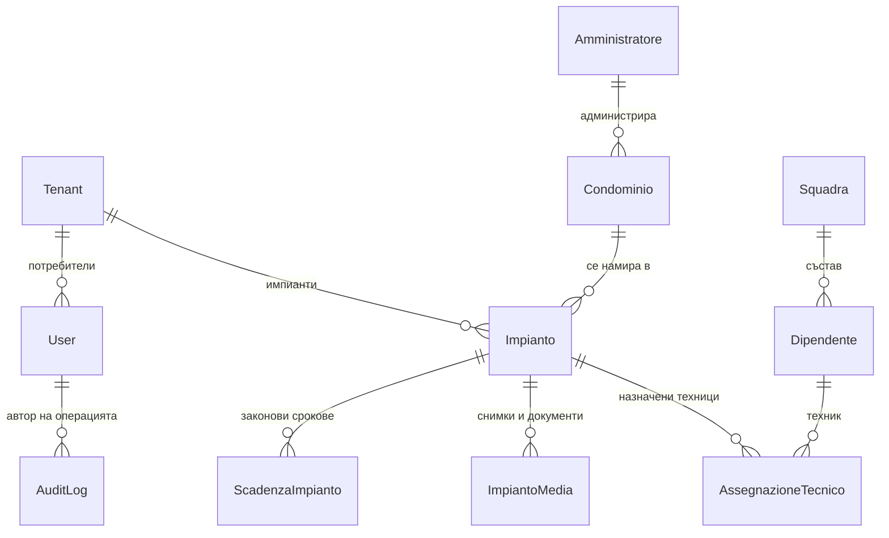
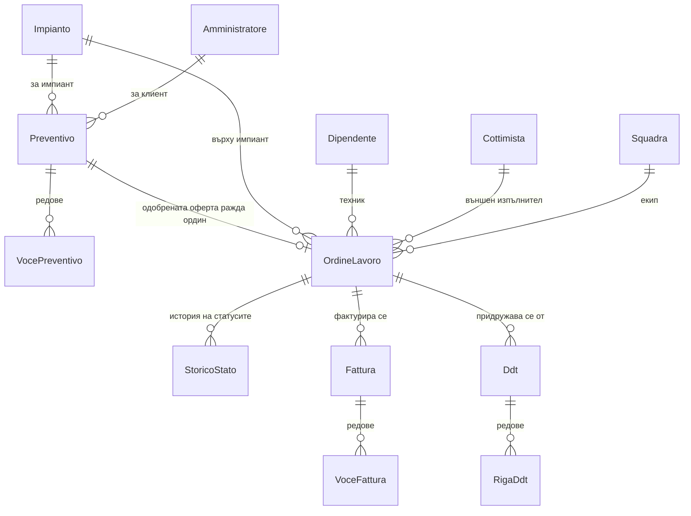
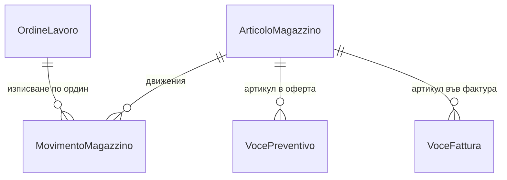
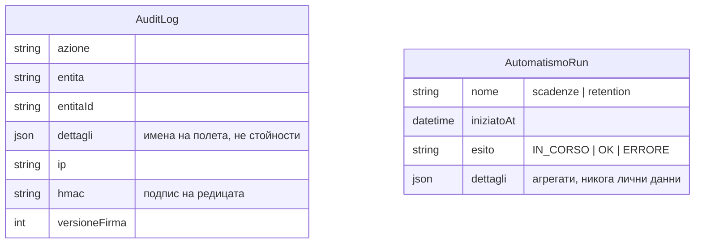

# Модел на данните

24 таблици, 13 енумерации. Диаграмата показва връзките, не всяко поле — за
пълния текст на схемата виж [`prisma/schema.prisma`](../prisma/schema.prisma).

## Общо устройство

Три пласта, които не се смесват:

1. **Служебен** — `Tenant`, `User`, `AuditLog`, `AutomatismoRun`. Носи достъпа,
   изолацията между фирмите и следата от операциите.
2. **Анагрифики** — кой и какво съществува: `Condominio`, `Amministratore`,
   `Impianto`, `Dipendente`, `Automezzo`, `Cottimista`, `Squadra`,
   `ArticoloMagazzino`. Дълъг живот, рядка промяна, никога не се трият когато са
   референцирани — деактивират се.
3. **Документи** — какво се е случило: `Preventivo` → `OrdineLavoro` → `Fattura`
   и `Ddt`, всеки със своите редове. Кратък живот на чернова, после стават
   неизменими по състояние.

Всички бизнес-таблици носят `tenantId` (виж [ADR 0004](adr/0004-multi-tenant-obshta-shema.md)).

## Ядро — импиант и обкръжението му

Импиантът е центърът на домейна: всичко останало отговаря на въпроса „чий е,
къде е, кой го поддържа и кога изтича нещо по него“.

## Активен цикъл

Потокът е `Preventivo → OrdineLavoro → Fattura` (+ `Ddt` за доставките).
`StoricoStato` пази всеки преход на ордина — записва се **в същата транзакция**
като самия преход, заедно с одит ред `STATE_CHANGE`.

## Склад

`ArticoloMagazzino.giacenza` е **производна**: не се пише директно от нито един
маршрут, а се движи само през `MovimentoMagazzino`, в транзакция и с условен
запис (две едновременни изписвания не могат да я вкарат в минус).

## Служебни таблици

`AuditLog` е неизменим по съдържание ([ADR 0002](adr/0002-nezimenim-odit-hmac.md));
`AutomatismoRun` е следата, по която `/api/healthz/automatismi` разбира, че cron-ът
е жив, и по която прочистването отчита какво е изтрило.

## Енумерации

| Енумерация | Стойности |
|---|---|
| `UserRole` | MASTER · ADMIN · DIREZIONE · RESPONSABILE · TECNICO · OPERATORE · CLIENTE |
| `StatoImpianto` | ATTIVO · FERMO · MANUTENZIONE · FUORI_SERVIZIO · DISMESSO |
| `StatoOrdine` | BOZZA · EMESSO · CONFERMATO · IN_LAVORO · SOSPESO · COMPLETATO · CHIUSO · CONTESTATO · ANNULLATO |
| `PrioritaOrdine` | ORDINARIA · URGENTE · EMERGENZA |
| `StatoPreventivo` | BOZZA · INVIATO · APPROVATO · RIFIUTATO · SCADUTO |
| `TipoFattura` | EMESSA · RICEVUTA |
| `StatoFattura` | BOZZA · EMESSA · INVIATA · PAGATA · SCADUTA · STORNATA |
| `TipoAmministratore` | PERSONA_FISICA · SOCIETA |
| `TipoDipendente`, `TipoCottimista` | по документацията |
| `TipoMagazzino` | по документацията |
| `TipoMovimento` | ENTRATA · USCITA · RETTIFICA |
| `TipoDocumento` | по документацията |
