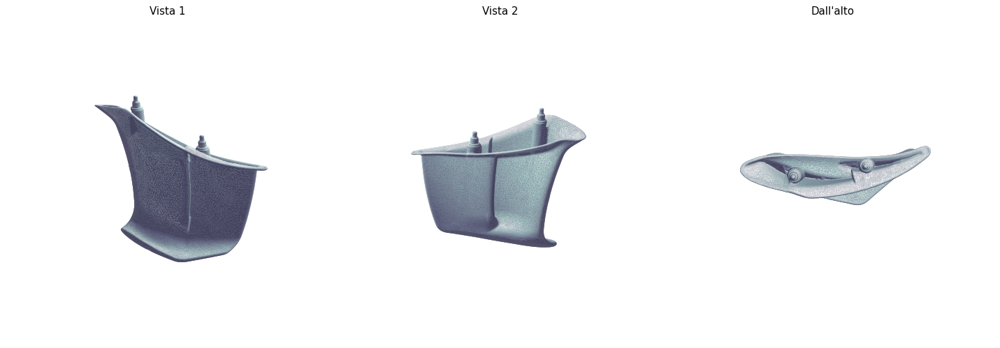

# Aletta v1 — mesh pulita per FreeCAD 1.1

Mesh originale: `Aletta v1 (1).stl` (scansione 3D, 92 MB, 1.842.602 triangoli) scaricata da WeTransfer ("Aletta scannerizzata").

## File

| File | Triangoli | Dimensione | Uso consigliato |
|---|---|---|---|
| `Aletta_v1_clean_200k.stl` | 199.684 | 9,5 MB | Massimo dettaglio pratico in FreeCAD |
| `Aletta_v1_clean_50k.stl` | 50.000 | 2,4 MB | Conversione mesh → solido più rapida |

Entrambe le versioni sono **watertight** (chiuse), **2-manifold**, con normali coerenti e un'unica componente connessa — pronte per `Part → Crea forma da mesh → Converti in solido` in FreeCAD 1.1 senza errori di shape non valida.

## Pulizia eseguita

1. Fusione dei vertici duplicati (l'STL grezzo aveva 3 vertici indipendenti per triangolo).
2. Rimozione di facce duplicate, facce nulle e vertici non referenziati.
3. Rimozione delle componenti flottanti (rumore di scansione).
4. Riparazione di spigoli e vertici non-manifold.
5. Chiusura di tutti i fori (3 fori grandi + 2 difetti topologici complessi, ricostruiti localmente).
6. Riorientamento coerente delle normali (verso l'esterno).
7. Decimazione quadrica con preservazione di topologia e bordi netti (200k e 50k triangoli).
8. Traslazione del pezzo vicino all'origine: offset applicato **(-1.431, +12.375, +419.343) mm** rispetto alle coordinate originali della scansione.

## Verifica finale

| Proprietà | 200k | 50k |
|---|---|---|
| Watertight | sì | sì |
| 2-manifold | sì | sì |
| Componenti connesse | 1 | 1 |
| Volume | 228,88 cm³ | 228,85 cm³ |
| Ingombro (X×Y×Z) | 189,0 × 61,0 × 210,4 mm | idem |

La deviazione di volume tra piena risoluzione e versione 50k è < 0,1%: la decimazione non ha alterato la forma in modo apprezzabile.

## Solido B-Rep già convertito

La conversione mesh → solido è già stata eseguita con il kernel OpenCascade
(lo stesso di FreeCAD): facce dai triangoli → cucitura a 0,01 mm → shell →
solido → correzione orientamento → validazione `BRepCheck_Analyzer` superata.

| File | Contenuto | Dimensione |
|---|---|---|
| `Aletta_v1_solid_50k.brep` | Solido nativo OpenCascade — si apre direttamente in FreeCAD | 33 MB |
| `Aletta_v1_solid_50k.step.zip` | Stesso solido in formato STEP AP214 (decomprimere prima) | 25 MB (124 MB estratto) |

Volume del solido: **228,85 cm³**, identico alla mesh di partenza. Un solo
solido, valido, pronto per operazioni booleane, tagli e misure nel workbench
Part. Nota: essendo nato da una scansione, il B-Rep è composto da ~50.000
facce triangolari piane — perfettamente lavorabile ma non parametrico; per
rimodellare in modo parametrico usarlo come riferimento per sketch e sezioni.

## Suggerimento per FreeCAD 1.1 (conversione manuale, se preferita)

1. `File → Importa` la versione 50k (o 200k se serve più dettaglio).
2. Workbench **Mesh**: `Analizza → Valuta e ripara mesh` confermerà 0 difetti.
3. Workbench **Part**: `Parte → Crea forma da mesh…` (tolleranza di cucitura 0,1 mm), poi `Converti in solido`.
4. Per un solido "pulito" con facce analitiche, in alternativa usare la forma come riferimento e rimodellare con sketch su sezioni.
