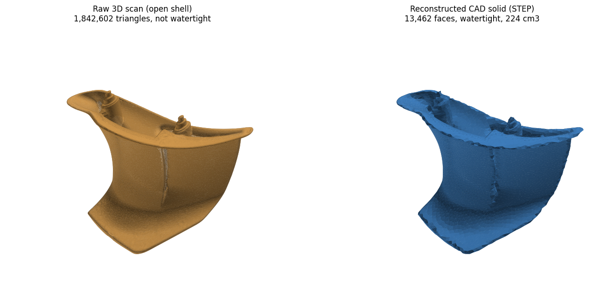

# Mesh → CAD: "Aletta scannerizzata"

Reverse-engineers the 3D-scanned triangle mesh **`Aletta v1 (1).stl`** (received
via WeTransfer — see `SOURCE.md`) into a watertight **CAD solid** in STEP format.



## What the input is
A raw optical scan of a curved vane/flap ("aletta"):
- 1,842,602 triangles, 921,950 vertices
- bounding box ≈ 189 × 61 × 210 mm
- a single open shell — **not watertight** (only the scanned side has data, with
  noise and holes). Mesh scans carry no design intent, so they are not CAD.

## Pipeline — `scan_to_cad.py`
```
python3 scan_to_cad.py "Aletta v1 (1).stl" output --faces 14000
```
1. **Clean** — drop duplicate/null faces, repair non-manifold edges & vertices.
2. **Screened Poisson reconstruction** (pymeshlab) — turns the open, noisy scan
   into a smooth **watertight manifold** surface.
3. **Decimate + isotropic remesh** — uniform, well-shaped triangles at a sane
   density (~14 k faces) so the geometry is CAD-friendly, not a 1.8 M-facet blob.
4. **OpenCASCADE (OCP)** — sew the triangles into a closed shell, promote to a
   `TopoDS_Solid`, merge coplanar faces, and write **STEP AP214** as a
   `MANIFOLD_SOLID_BREP`.

## Outputs (`output/`)
| file | what |
|------|------|
| `Aletta_solid.step` | **the deliverable** — closed solid B-rep, opens as a solid body in SolidWorks / Fusion 360 / Onshape / FreeCAD / CATIA (volume ≈ 224 cm³) |
| `Aletta_watertight.stl` | the cleaned, watertight, decimated mesh (intermediate / preview) |
| `comparison.png` | raw scan vs reconstructed solid |

## Dependencies
```
pip install numpy trimesh numpy-stl scipy networkx fast-simplification pymeshlab cadquery-ocp
# system: libglu1-mesa
```

## Scope note — faceted vs parametric
This produces a **tessellated solid**: a faithful, watertight B-rep of the
scanned shape that any CAD package imports as a solid body. It is the correct
automated end point for "mesh → CAD".

It is **not** a feature tree (editable sketches / extrudes / fillets with
dimensions). True parametric reverse-engineering of a freeform scanned part is
an interactive job: import this STEP into a dedicated reverse-engineering tool
(Geomagic Design X, Fusion 360 Mesh/Shape workspace, Ansys SpaceClaim,
SolidWorks ScanTo3D) and fit analytic surfaces to taste. The clean watertight
solid here is the ideal starting point for that.

An experimental spline-surface route via gmsh `classifySurfaces` /
`createGeometry` was evaluated; it proved unreliable on this noisy open scan
(`Wrong topology of boundary mesh for parametrization`), so the robust
OpenCASCADE solid route above is the shipped pipeline.
