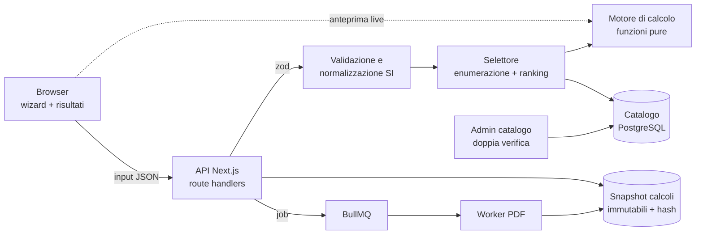

# 9. Architettura del software

[← Indice](README.md)

## 9.1 Principi di progetto

1. **Motore di calcolo puro e deterministico.** Tutte le formule vivono in un modulo
   TypeScript senza dipendenze da UI, database o rete: stessi input + stessa versione del
   motore + stesso profilo normativo + stessa versione del catalogo ⇒ stesso risultato, bit
   per bit. Lo stesso codice
   gira nel browser (feedback istantaneo mentre l'utente compila) e sul server (risultato
   ufficiale, l'unico che finisce nel report). Il server **non si fida mai** del risultato
   calcolato dal client.
2. **Ogni verifica è spiegabile.** Una verifica restituisce sempre: identificativo,
   riferimento normativo (clausola), formula usata, valore, limite, margine, esito e le
   grandezze intermedie. Una configurazione scartata dice *perché* è stata scartata.
3. **Tracciabilità totale.** Ogni calcolo salvato è uno snapshot immutabile: input
   normalizzati, versione del motore (semver), profilo normativo, versione del catalogo,
   risultati, hash SHA-256 del tutto. Un report PDF di tre anni fa deve poter essere rigenerato identico.
4. **Unità SI all'interno, conversioni solo ai bordi.** Internamente N, m, kg, s, rad. L'utente
   inserisce kg, mm, m/s, gradi; la conversione avviene una volta sola, nello schema di input.
5. **Tecnologia collaudata.** Lo stack è quello già in produzione nel monorepo
   (`linketto/`, `zabobovdol/`, `piuma/`): nessuna libreria nuova senza un motivo misurabile.

## 9.2 Stack consigliato

| Livello | Scelta | Già in produzione in | Perché |
|---|---|---|---|
| Web app + API | Next.js 15 (App Router) · React 19 · TypeScript strict · Tailwind | `linketto/`, `zabobovdol/` | Standard aziendale per i SaaS; un solo deploy per UI e API |
| Validazione input | zod 3 | tutti i prodotti TS | Ogni input esterno validato; lo schema zod è anche la fonte dei vincoli mostrati nel form |
| Database | PostgreSQL + Prisma 6 (`migrate deploy` in produzione) | `linketto/`, `zabobovdol/`, `piuma/` | Catalogo relazionale, snapshot dei calcoli in JSONB |
| Code di lavoro | BullMQ 5 + Redis | `piuma/` | Generazione PDF e ricalcoli massivi fuori dalla richiesta HTTP |
| Report PDF | ReportLab + font DejaVu registrati (standard aziendale per testi cirillici) | standard Carbon Stealth | Il report deve funzionare in IT/EN/BG; mai Helvetica/Times |
| i18n | next-intl, lingue IT (default) · EN · BG | `linketto/` | Mercato italiano, documentazione tecnica spesso in inglese |
| Autenticazione | JWT in cookie httpOnly, Argon2id, gerarchia di ruoli | `piuma/` (Argon2id) | Dati di progetto dei clienti = dati riservati |
| Log | pino, nessun dato personale nei log | `piuma/` | Log strutturati, correlabili al calcolo |
| Test | `node:test` via tsx (unit) · property-based · Playwright (e2e) | `linketto/`, `piuma/` | Vedi capitolo 10 |
| Deploy | Docker compose + nginx + Let's Encrypt, `GET /health` | `deploy/` del monorepo | Flusso `fetch-deploy.sh` → `autodeploy.sh` già esistente |

Alternativa per il PDF, se si preferisce un unico runtime Node: HTML → PDF con Chromium
(Playwright) e font self-hosted con glifi cirillici, lo stesso schema già usato in
`panev/3d/pdf/print.mjs`. Vantaggio: il report a schermo e quello stampato condividono un solo
template. Svantaggio: immagine Docker più pesante (Chromium).

## 9.3 Moduli



| Modulo | Responsabilità | Dipende da |
|---|---|---|
| `calc/` | Formule, verifiche, riferimenti normativi, tipi dei risultati | nulla (solo TypeScript) |
| `calc/input.ts` | Schema zod degli input, conversione unità, valori di default dichiarati | zod |
| `select/` | Enumerazione delle configurazioni del catalogo, filtro, ranking, motivazioni degli scarti | `calc/` |
| `catalog/` | Modello dati, import CSV/XLSX, flusso di approvazione a quattro occhi, versioni | Prisma |
| `app/` | Wizard, risultati, confronto, storico progetti, admin | Next.js, next-intl |
| `report/` | Worker che trasforma uno snapshot in PDF | BullMQ, ReportLab |

Il confine di `calc/` va fatto rispettare da una regola ESLint `no-restricted-imports`:
nessun import da `next`, `@prisma/client`, `fs` o rete dentro `calc/`.

## 9.4 Il contratto del motore di calcolo

```ts
export type CheckStatus = "pass" | "fail" | "warn" | "not_applicable";

export type CheckResult = {
  id: CheckId;                 // "traction.loading", "rope.safety_factor", ...
  clause: string;              // "EN 81-50:2020 §5.11" — da verificare sul testo acquistato
  status: CheckStatus;
  value: number;               // grandezza calcolata, in SI
  limit: number;               // limite normativo o del costruttore, in SI
  unit: string;
  utilisation: number;         // value/limit (o l'inverso per i limiti inferiori): < 1 = OK
  intermediates: Record<string, number>; // T1, T2, f, e^(fα), Nequiv, ...
};

export type Evaluation = {
  engineVersion: string;
  configuration: ConfigurationRef;
  checks: CheckResult[];
  feasible: boolean;           // nessun check "fail"
};

export function evaluateConfiguration(input: LiftInput, cfg: MachineConfiguration): Evaluation;
```

Regole del motore:

- **Nessun valore implicito.** Ogni default (rendimento, accelerazione, attrito) è dichiarato
  nello schema di input con la sua fonte e compare nel report come “assunto”.
- **Doppia precisione IEEE-754 e arrotondamento solo in presentazione.** I confronti con i
  limiti usano il valore non arrotondato; il report mostra 3–4 cifre significative.
- **Denaro separato dalla fisica.** I prezzi del catalogo sono interi in centesimi di euro,
  mai numeri in virgola mobile.
- **Profilo normativo esplicito.** Ogni calcolo dichiara il profilo usato (`EN81-50:2020` oggi,
  `EN-ISO-8100-2:2026` durante e dopo la transizione, capitolo 2.2); formule, coefficienti e
  tabelle che cambiano tra i profili vivono in moduli separati e testati entrambi.
- **Versione del motore = semver.** Una modifica di formula è una *minor* o una *major*,
  mai una *patch*, e rigenera i casi di riferimento (capitolo 10).

## 9.5 Prestazioni: basta l'enumerazione completa

Un catalogo realistico (50 modelli × 7 pulegge × 7 rapporti × 6 motori × 2 freni =
29 400 configurazioni) è stato valutato con un prototipo delle verifiche in **circa 25 ms**
su Node 22 (misura locale, `performance.now()`, dopo riscaldamento del JIT). Non servono
solutori di ottimizzazione né cache: si valuta tutto, si filtra e si ordina. Questo rende
anche banale spiegare gli scarti.

## 9.6 API

| Metodo e percorso | Scopo | Autorizzazione |
|---|---|---|
| `POST /api/surveys` | Salva il rilievo di un impianto esistente (valori con origine, foto delle targhe) | utente autenticato |
| `POST /api/surveys/:id/baseline` | Calcola l'argano esistente e segnala le incoerenze dei dati | proprietario |
| `POST /api/calculations` | Valida gli input, esegue selezione e verifiche, salva lo snapshot | utente autenticato |
| `GET /api/calculations/:id` | Legge uno snapshot (input, risultati, versioni, hash) | proprietario o stesso tenant |
| `POST /api/calculations/:id/verify` | Verifica una configurazione scelta a mano (anche fuori catalogo) | utente autenticato |
| `POST /api/calculations/:id/report` | Accoda la generazione del PDF, restituisce l'id del job | proprietario |
| `GET /api/reports/:jobId` | Stato del job e link di download firmato | proprietario |
| `GET /api/catalog/models` | Catalogo pubblicato (versione corrente) | utente autenticato |
| `POST /api/admin/catalog/…` | Bozze e approvazione dei dati del catalogo | ruolo editor / approvatore |
| `GET /health` | Stato di DB, Redis, versione del motore e del catalogo | pubblico |

Tutte le rotte con autenticazione controllano anche l'**autorizzazione** sul singolo
progetto (isolamento per tenant), non solo l'identità. Rate limit su autenticazione e sugli
endpoint di calcolo.

## 9.7 Esperienza utente

Il percorso di default è la **sostituzione dell'argano**; l'impianto nuovo è una variante con
meno passi. Ogni passo ha validazione immediata, e ogni valore mostra la sua origine (targa,
misura, stima, catalogo):

1. **Rilievo dell'impianto esistente** — targhe di motore e riduttore (anche da foto), puleggia,
   funi, freno, componenti di sicurezza, locale macchina (capitolo 6.2).
2. **Impianto** — tipo, portata, massa della cabina, bilanciamento o carico di equilibrio misurato,
   velocità nominale, corsa, fermate, testata, fossa.
3. **Disposizione e geometria** — macchina in alto o in basso, schema del percorso delle funi con
   le pulegge di rinvio e le quote; l'angolo di avvolgimento compare calcolato su uno schizzo che
   si aggiorna mentre si inseriscono le quote.
4. **Funi, servizio e azionamento** — funi nuove, taglia, compensazione, avviamenti/ora,
   intermittenza, alimentazione, rendimento del vano.
5. **Vincoli e preferenze** — produttori ammessi, basamento e ancoraggi, protezioni già
   presenti, manovra di emergenza, criterio di ordinamento.

Pagina risultati: il calcolo dell'argano esistente con le eventuali incoerenze dei dati; le
configurazioni ammissibili con un semaforo per ogni verifica; il confronto vecchio/nuovo; le
“quasi ammissibili” con il motivo dello scarto; gli adeguamenti UNI 10411-1 con il loro stato;
l'analisi di sensibilità sulla massa della cabina (±10%).

Il prototipo (calcolatore in una pagina) ha mostrato che chi lo usa in cantiere è il tecnico
manutentore, non il progettista: più di sessanta campi e quattordici riquadri di risultati in
fila sono troppi. Per questo ha due modalità, con lo stesso motore e gli stessi risultati:

- **Semplice** (default) — 46 campi (esempio A) nell'ordine di lavoro: impianto, disposizione,
  argano esistente, argano nuovo o proposta, funi. I dati meno comuni (fune oltre la corsa,
  inerzie, rendimenti del vano e inverso, poli, frequenza, flessioni in più, servizio) restano
  nascosti con i valori caricati o tipici, e una nota lo dice. Le flessioni delle funi si contano
  dalla disposizione (5.7). Sotto la proposta, il riquadro «Esito in breve» ha una riga per area
  (aderenza, funi, motore e riduttore, freno, albero e ancoraggio, manovra di emergenza, dati
  incerti), ciascuna con semaforo e una frase con i numeri che contano: utilizzo dell'aderenza,
  coefficiente di sicurezza delle funi effettivo e richiesto, potenza necessaria e di targa,
  intervallo di coppia del freno, carico sull'albero, forza della manovra a mano, verifiche che
  cambiano esito con massa della cabina e bilanciamento incerti (8.9). Le tabelle tecniche sono
  raccolte in un blocco chiuso da aprire su richiesta.
- **Esperto** — tutti i campi (63 nell'esempio A) e tutti i riquadri aperti, come prima.

Il pulsante «Stima F_min e massa dal diametro» riempie carico di rottura e massa lineare con
valori tipici per funi 8×19 Seale 1570 N/mm², segnalati come stima: vanno sostituiti con quelli
del certificato. Il PDF e il riepilogo da copiare contengono sempre il testo completo,
qualunque sia la modalità.

## 9.8 Sicurezza e privacy

- zod su ogni input esterno, anche nelle rotte admin; nessuna concatenazione di stringhe in
  SQL (solo Prisma).
- Cookie httpOnly, `SameSite=Lax`, `Secure`; CORS con whitelist; CSP senza `unsafe-inline`.
- Segreti solo da variabili d'ambiente sul server, mai nel repository o nell'archivio di deploy.
- Dati personali minimi (account utente); i dati di progetto sono dati commerciali riservati
  del cliente: isolamento per tenant, backup cifrati, hosting nell'UE.
- Log di audit sulle modifiche al catalogo (chi, cosa, quando, valore prima e dopo).
